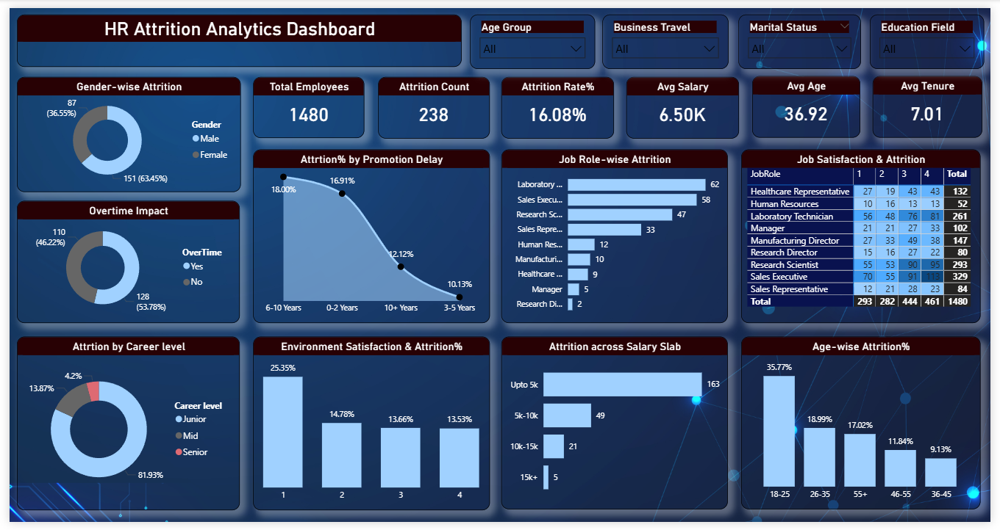

# HR Attrition Analysis

## Overview

Employee attrition is one of the key challenges faced by organizations, as high employee turnover can impact productivity, increase hiring costs, and affect overall business performance.

This project analyzes employee attrition patterns using Power BI to identify the key factors influencing employee turnover, including age, salary, job role, career level, promotion delay, overtime, and employee satisfaction. The dashboard provides actionable insights that can help HR teams improve employee retention and workforce planning.

---

## Tools Used

- Power BI
- DAX (Data Analysis Expressions)
- Microsoft Excel (Data Validation and Basic Data Cleaning)

---
## Dataset Source

The dataset used in this project was obtained from Kaggle and is used for learning and analytical purposes.

## Dataset Features

The analysis was performed using employee demographic, compensation, performance, and satisfaction-related attributes, including:

- Age
- Age Group
- Attrition
- Business Travel
- Department
- Education Field
- Gender
- Job Role
- Job Level
- Job Satisfaction
- Environment Satisfaction
- Marital Status
- Salary Slab
- Overtime
- Years Since Last Promotion

## Key Performance Indicators (KPIs)

- Total Employees: 1,480
- Attrition Count: 238
- Attrition Rate: 16.08%
- Average Salary: 6.50K
- Average Age: 36.92 
- Average Tenure: 7.01 Years

---

## Dashboard Screenshot

### HR Attrition Dashboard
## Project Files

- 📊 [Power BI Dashboard](dashboard/hr_attrition_analysis.pbix)

The Power BI dashboard includes:

- Gender-wise Attrition
- Overtime Impact
- Attrition by Career Level
- Attrition Percentage by Promotion Delay
- Environment Satisfaction & Attrition Percentage
- Job Role-wise Attrition
- Job Satisfaction Impact
- Attrition Across Salary Slabs
- Age-wise Attrition Percentage

Interactive slicers:

- Age Group
- Business Travel
- Marital Status
- Education Field

---

## Key Insights

- The organization has an overall attrition rate of **16.08%**.

- Male employees account for a higher share of attrition compared to female employees.

- Employees who work overtime show higher attrition than employees who do not work overtime.

- Junior career-level employees contribute the largest share of total attrition.

- Employees with a promotion delay of **6–10 years** show the highest attrition percentage among promotion categories.

- Employees with the lowest environment satisfaction level exhibit the highest attrition percentage.

- The **18–25 age group** records the highest attrition percentage, while the **36–45 age group** records the lowest.

- Laboratory Technicians show the highest attrition count among job roles.

- Employees earning up to **5K salary** account for the highest attrition, while employees earning above **15K salary** account for the lowest.

---

## Conclusion

This dashboard provides a comprehensive view of employee attrition and highlights the major factors influencing workforce turnover. The analysis indicates that overtime, low environment satisfaction, lower salary bands, promotion delays, and younger employees are strongly associated with higher attrition. These insights can help HR teams make data-driven decisions to improve employee retention and workforce management.
